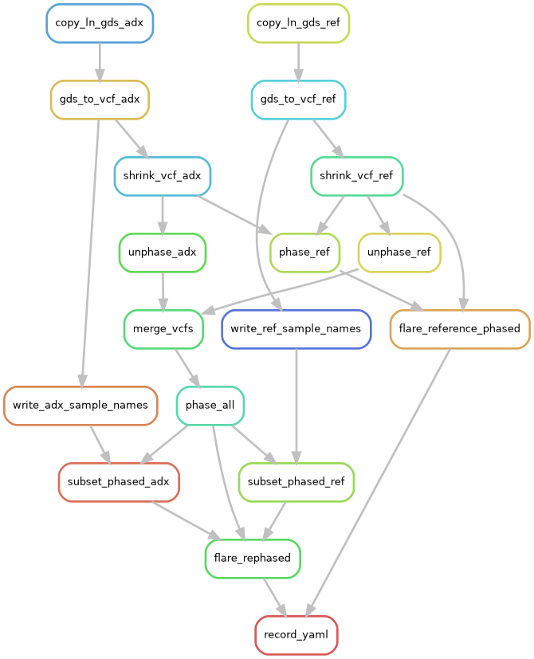

## Pipeline for local ancestry & IBD inference, 

This pipeline performs phasing, IBD segment detection, and local ancestry inference for an analysis of target admixed samples.

You can look at `dag-*` files to see what the pipeline looks like / looked like.

### Installation

1. `git clone https://github.com/sdtemple/flare-hapibd-beagle-pipeline`
2. Install `java` so as to be able to run `java -jar` on terminal
3. `bash get-software.sh software` (requires `wget`)
4. `conda env create -f conda-env.yml`
    - I recommend using `mamba` of some sort (https://mamba.readthedocs.io/en/latest/index.html)
    - In which case, `mamba env create -f conda-env.yml`

### Requirements

- GDS files for each chromosome
    - Reference samples
    - Target admixed samples
- Map between reference sample IDs to their reference panel
    - Point to this file in your YAML settings

### Run the pipeline 

1. `conda activate flare24`
2. Modify the `your.analysis.arguments.yaml` file
    - See the `change:` settings
    - You need to choose a reference sample!
3. `snakemake -c1 -n`
    - This is a dry run to see what will be run
4. `nohup snakemake -c1 --latency-wait 300 --keep-going --cluster " [your command]  " --configfile your.analysis.arguments.yaml --jobs XXX &`
    - Other useful `snakemake` commands
        - `--rerun-incomplete`
        - `--rerun-triggers mtime`
        - `--force-all`
    - Commands for `qsub`
        - `--cluster "qsub -q your-queue.q -m e -M your.email@uni.edu -pe local XXX -l h_vmem=XXXG -V" `
        - "-V" is important to pass in your conda environment!
        - "-pe local XXX" is how many threads you will use
        - You don't have to send emails to yourself if you don't want to
    - Commands for `slurm`
        - TBD
    - You can sign out of cluster. `no hup ... &` will keep this as an ongoing process until complete
5. Your LAI results in a `lai/` folder
6. Your IBD results in a `ibdsegs/` folder
    - By default, do not detect IBD segments

For reproducibility, the `arguments.yaml` in the main folder says what you ran. Don't change it ever!

For robustness, you can create different `*.yaml` settings and see how results change. 

Make sure to change the `your-analysis-folder` setting.

### Other notes

There are two phasing strategies:
- Use the reference to phase the target sample (could introduce imputed values)
    - This will likely create more markers in the target sample data
- Rephase target and reference targets altogether
    - This will likely create fewer markers in reference and target sample data

You can call detect IBD segments by removing the comments in record_yaml rule.

Possible bugs:
- Names are difference in CHROM column between reference and target samples
- Running out of memory: increase cluster-resouces:xmxmem in yaml and terminal pass into `--cluster`
- Reference sample is not phased
- JAR file is corrupted: download a fresh version 

### Contact

Seth D. Temple

sdtemple.github.io

sdtemple@uw.edu

### Citation

If we publish this pipeline somewhere, I will point out the paper.

For now, please acknowledge me in publication (smiley face)

### Development

- This repo currently uses snakemake 7.25.2
    - May extend to version 8 as I develop familiarity in other repos
- Implement other local ancestry inference software
    - For example, MOSAIC from Salter-Townshend and Myers
- Impute other phasing software
    - For example, SHAPEIT
- Give instructions for how to run with slurm workflow manager
- Give instructions about if your initial data is GDS or VCF

### Initiating with *.vcf.gz files instead of *.gds files

The pipeline starts with GDS files for each chromosome. It converts these to VCF files.

If you have VCF files already, don't waste your time converting VCF to GDS.

Use `ln -s initial/folder/location/chr*.vcf.gz your/analysis/folder/gtdata/adxpop/chr*.vcf.gz` to create a symbolic link.
- Do this in `your-analysis-folder/gtdata/adxpop` and `your-analysis-folder/gtdata/refpop/`
    - You may need to
        1. `mkdir your-analysis-folder`
        2. `mkdir your-analysis-folder/gtdata`
        3. `mkdir your-analysis-folder/gtdata/adxpop`
        4. `mkdir your-analysis-folder/gtdata/refpop`
- If you have VCFs for references and GDS for admixed, do the symbolic link for the references only.
    - And vice versa

The minor allele count and minor allele frequency filters are applied redundantly:
- In the GDS to VCF conversion
- And shrinking the VCF if you start from VCF

### keep-samples and exclude-samples arguments

The `keep-samples` in the rule `gds_to_vcf_adx` controls memory and time if you have a huge admixed target sample, but you only want to study a subset of them.
- If you want to study all of them, make a one column text file with sample IDs for all samples

The `exclude-samples` is an option in the Browning Lab software (beagle, flare, etc). This is a one column text file with sample IDs for the samples you do not want to study. Most of the time this should be the empty file `excludesamples.txt` in this repo. If you use it with a non-empty file, it will subset the VCFs in the phasing step.

### rename-chrs-map argument

Sometimes the recombination map and the VCF/GDS data have different names for the chromosome column, e.g., chr22 versus 22. Choose between one of four text files in the `rename-chrs/` from this repo.
- The first column is the old name, the name of chromosome in the VCF file.
- The second column is the new name, the name of the chromosome in the map file.
- There are separate YAML options for the reference and admixed target samples. 

### A pilot study on small chromosomes

Your chromosome files should be named numerically, e.g., chr1 all the way to chr22. If you want to study some sex chromosome or otherwise, use symbolic links to say call it chr23.

In your YAML configuration file, the chromosome files between `chr-low` to `chr-high` will be analyzed. Use a subset of the smallest chromosomes to test the pipeline, e.g., `chr-low: "21"` and `chr-high: "22"`. Then, to run the entire analysis, use `chr-low: "1"` and `chr-high: "22"`.